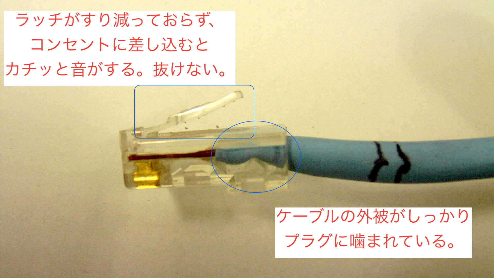
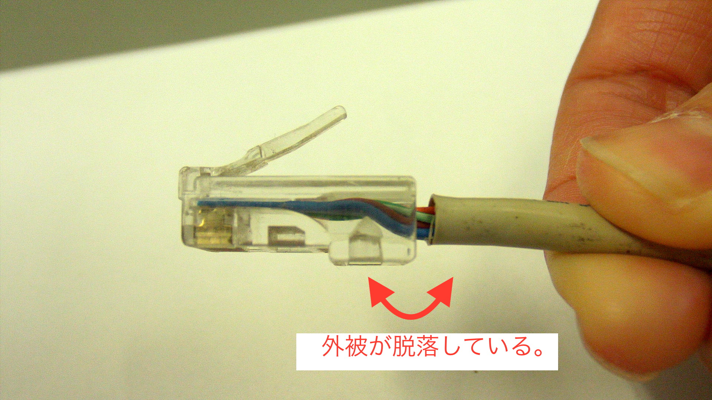
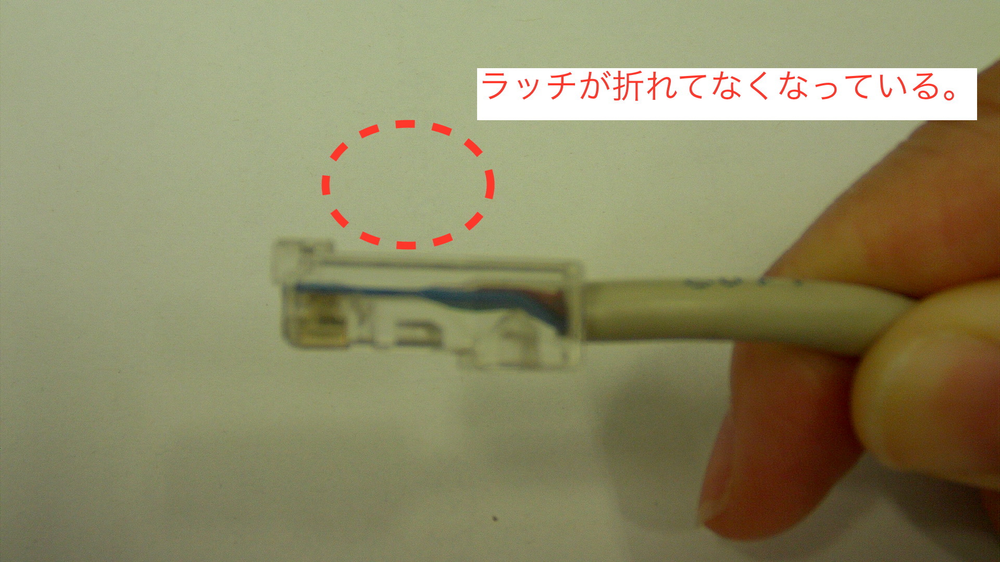
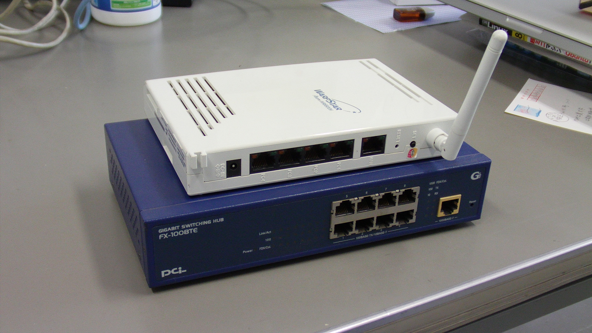
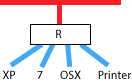
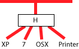
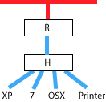
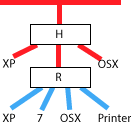
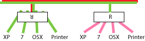
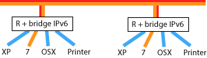

### 総合システムネットワーク講習会

総シスネットワークは夏休み頃から不調が目立つ。

#### 今回の目的

* 卒論シーズンを迎え、問題点をクリアする。
* 不調の原因を作らないよう、最低限を覚える。
* 責任者メールリストの作成。

この資料のアドレスは [どこかに](http://some.where) です。

----
### 知っておくべきこと

* 九工大ネットワークは脆弱。
* 一研究室のケアレスミスがサブネット全体のネットワークに影響する。
* デフォルトでつなぐと良くないことが起こる。

----
### 何が不調か？

* メールの送受信に時間がかかる。
* ファイル転送が遅い。
* リモートログインしての作業がとぎれとぎれ。
* 丸腰の Windows がネットワーク上に見える。

````
dhcp30.mns.kyutech.ac.jp (150.69.84.30) at 00:0a:79:60:f5:f3 [ether] on eth0
dhcp37.mns.kyutech.ac.jp (150.69.84.37) at 00:3a:9d:20:ff:59 [ether] on eth0
dhcp35.mns.kyutech.ac.jp (150.69.84.35) at 20:c9:d0:2a:c2:6b [ether] on eth0
dhcp24.mns.kyutech.ac.jp (150.69.84.24) at 10:6f:3f:fc:b5:df [ether] on eth0
````

----
### こんなことはない
前スライドの<span class='warn'>「丸腰 PC」</span>を除いて、

- パスワードやデータが漏れることはない。
- PCのデータが消えることはない。
- PCが知らない間に遠隔操作されることはない。

ただし、きちんとルータ下に収まった PC でも、
USBスティックやメールでウィルスを持ち込んでしまうことはある。
そんなのは別。守れない。

研究活動以外、YouTube や楽曲の違法ダウンロードでウィルス食らったやつは
<span class='warn'>自分で責任とれ</span>。

----

### 原因

研究室PCがウィルスに感染していないとしても、気になる点がいくつか。

* ケーブルの扱いが雑。
* ルータ、ハブの役割を理解していない。
* ルータの設定を確認していない。九工大ネットはデフォルト値の使用を許していない。
* 無線 AP にパスワード設定していない。
* 部屋が汚い。

----
### ケーブル

* きちんとしたケーブルを使わないと通信は安定しない。



* きちんとしたケーブルは外被がプラグにきちっと押さえられている。



* きちんとしたケーブルはラッチが折れていない。差し込むと「カチっ」とはまり、少々引いても抜けない。



----
### ルータ・ハブ

同じ箱に見えるが、役割はまったく違う。



____

#### ルータは上下を区別する



____

#### ハブは上下の区別なし



----
### 正：壁面からのケーブルにルータ、ルータとPCの間にハブ



----
### 間違い：ハブがルータよりも上流にある

ルータとハブの場所が逆。守られているつもりで晒される PC。



----
### ルータの向きを逆にすると他研究室も止める

ルータの向きが逆。

* 自分研究室のPCがネットにつながらない。
* 研究室のルータに間違いアドレスを提供してしまう。食らった研究室は全滅。



----
### 間違い例

空いているケーブルを収めたつもりだったが、研究室がネットワークから切り離される（ことになっているが、、、）


----
### 九工大ネットは IPv6 が嫌い

* デフォルトで IPv6 ブリッジの設定が生きているルータがある。設定を外すこと。
* デフォルトで Windows7 は IPv6 がイネーブルされている。設定を外すこと。



設定が確認できないときはつなぐな。

----
### 自分 PC の IP アドレスを知れ。

自分PCのIPアドレスみると、
* 自分PCが正しくルータの下に収まっているか、
* 九工大ネットが毛嫌いする IPv6 は有効か、無効か
を確認できる。

Windows なら「コマンドプロンプト」開いて ipconfig。IPAddress の右。
````
> ipconfig
Ethernet adapter ローカルエリア接続:
  IP Address ............: 192.168.10.3
  Subnet Mask ...........: 255.255.255.0
  Default Gateway .......: 192.168.10.1
````

OSXやLinuxはターミナル開いて ifconfig。inet addr: の右が IP アドレス。
````
$ ifconfig
eth0      Link encap:Ethernet  HWaddr 52:54:00:38:ce:ef
          inet addr:10.0.3.24  Bcast:10.0.3.255  Mask:255.255.255.0
          inet6 addr: fe80::5054:ff:fe38:ceef/64 Scope:Link
          UP BROADCAST RUNNING MULTICAST  MTU:1500  Metric:1
          RX packets:2345960 errors:0 dropped:0 overruns:0 frame:0
          TX packets:839637 errors:0 dropped:0 overruns:0 carrier:0
          collisions:0 txqueuelen:1000
          RX bytes:374711620 (374.7 MB)  TX bytes:174208087 (174.2 MB)
````

ifconfig の例にある fe80: で始まるようなのが見えるときは IPv6 が有効になっている。

----
### まとめ

* 知らずに使うな。
* ケーブルをあまく見るな。
* 大学院生を信用するな。
* 自分で考えろ。

